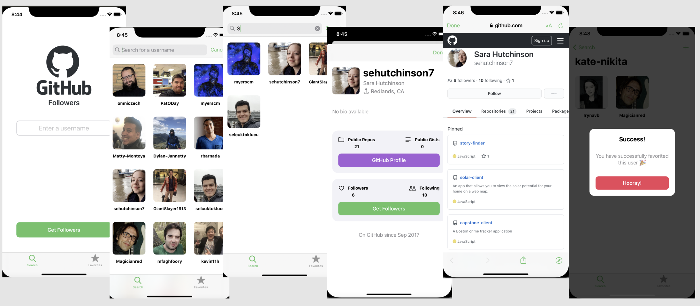

# GitHubFollowers

This is an iOS application to track GitHub users' followers. 

It was built based on the tutorial by Sean Allen with some additional features.

The project is meant to use no outside frameworks, so it really gave me a much deeper understanding of working with data, network calls, etc. exclusively by means of Swift.

